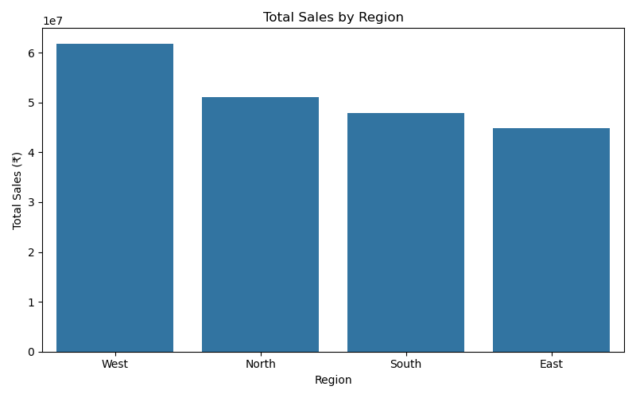
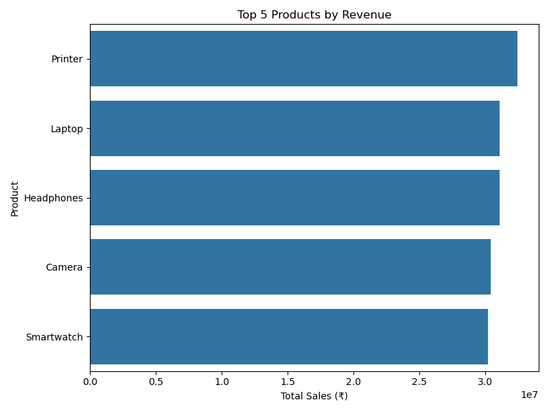
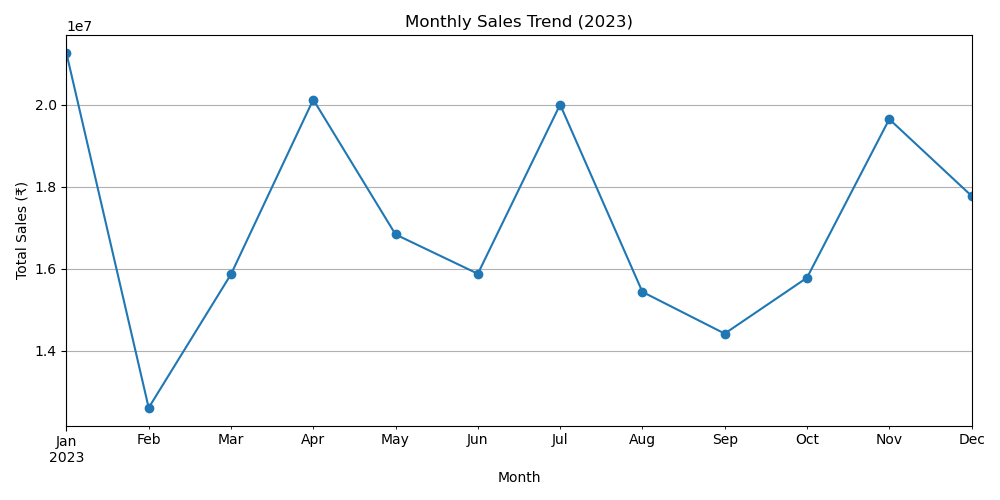

# 📊 Sales Performance Analysis (2023)

A data analysis project exploring the 2023 sales performance of a retail company to identify revenue trends, top products, and regional performance.

---

## 🎯 Project Objective

The goal of this project is to analyze the company’s 2023 sales data to uncover actionable insights such as:

- Which **regions** generated the highest revenue?
- Which **products** performed best?
- How did **monthly sales trends** evolve over the year?

---

## 🧰 Tools & Technologies Used

| Category | Tools |
|-----------|--------|
| Data Analysis | Python, Pandas |
| Visualization | Matplotlib, Seaborn |
| Notebook | Jupyter Notebook |
| Dataset | Synthetic dataset (1,000 orders from 2023) |

---

## 🧹 Data Cleaning Steps
- Handled missing values in categorical columns using mode.
- Verified data types and formatted date columns.
- Added derived features like **Month** for trend analysis.

---

## 📊 Exploratory Data Analysis

### 🔹 Total Sales by Region

### 🔹 Top 5 Products by Revenue

### 🔹 Monthly Sales Trend (2023)

---

## 💡 Key Insights

✅ Total Revenue Generated  
✅ Top Region 
✅ Best Selling Product
✅ Sales 
